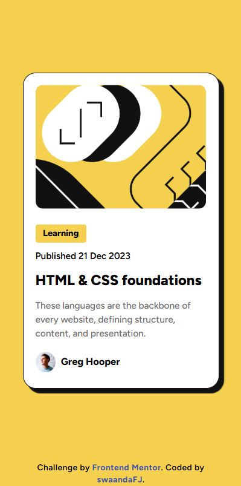
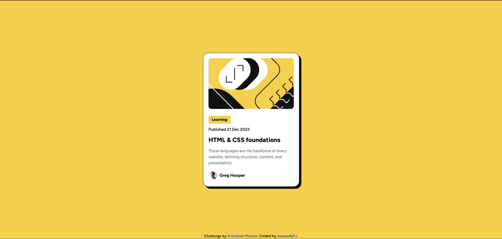

# Frontend Mentor - Blog preview card solution

This is a solution to the [Blog preview card challenge on Frontend Mentor](https://www.frontendmentor.io/challenges/blog-preview-card-ckPaj01IcS). Frontend Mentor challenges help you improve your coding skills by building realistic projects. 

## Table of contents

- [Overview](#overview)
  - [The challenge](#the-challenge)
  - [Screenshot](#screenshot)
  - [Links](#links)
- [My process](#my-process)
  - [Built with](#built-with)
  - [What I learned](#what-i-learned)
  - [Continued development](#continued-development)
  - [Useful resources](#useful-resources)
- [Author](#author)

## Overview

### The challenge

Users should be able to:

- See hover and focus states for all interactive elements on the page

### Screenshot




### Links

- ✅ Solution URL: [Frontend solution](https://www.frontendmentor.io/solutions/responsive-blog-preview-card-layout-using-html-and-css-UR7BsZBjvq)
- 🌐 Live Site URL: [GitHub Pages](https://swaandafj.github.io/blog-preview-FrontendMentor/)

## My process

### Built with

- Semantic HTML5 markup
- CSS custom properties
- Flexbox (for centering the card)

### What I learned

This project was a great way to practice using semantic HTML5 markup properly. I gained additional understanding of website responsiveness and I think I'm well on my way to actually building a project using mobile-first workflow. 
I came across the HTML `<picture>` tag while working on making my web page responsive. In so doing, I learned how to use the HTML `<picture>` and `<source>` tags to more effectively manipulate the responsiveness of a web page.

```html
  <picture class="thumbnail">
    <source media="(max-width:350px)" srcset="./images/illustration-article.jpg">
    
  </picture>
```

### Continued development

Going forward, I hope to:
- build confidence in order to write code entirely on my own without needing to copy and paste from external sources.
- make additional research to acquire necessary skills as an aspiring developer.
- master various CSS techniques so as to improve my creative approach to UI and frontend development.

### Useful resources

- [Google Fonts](https://fonts.google.com/) - This helped me choose specific fonts to use in my project. I really liked this pattern and will use it going forward.
- [W3Schools](https://www.w3schools.com/) - I have been using W3schools for a while now and it hasn't disappointed me yet. W3schools helped me answer questions I had while working on this project.
- Custom AI prompts

## Author

- 🌐 Website - [GitHub Pages](https://swaandafj.github.io/blog-preview-FrontendMentor/)
- Frontend Mentor - [@swaandaFJ](https://www.frontendmentor.io/profile/swaandaFJ)
- Twitter - [@swaan_dagwi](https://www.twitter.com/swaan_dagwi)
- Instagram - [@swaandagwi](https://www.instagram.com/swaandagwi)

---
*[Swaandagwi Feng Jah]*